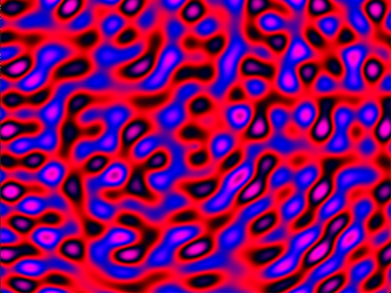
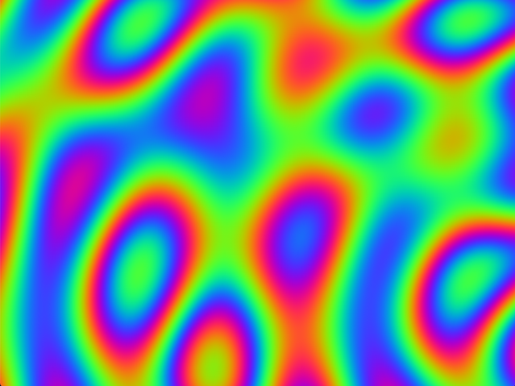
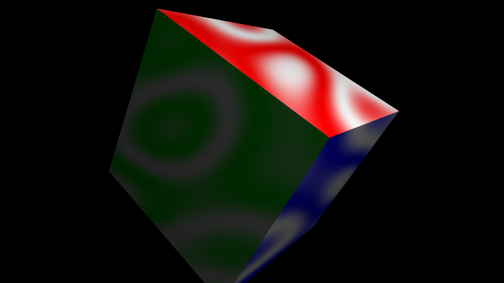

# Plasma

Some different C implementations of the classic [plasma](https://en.wikipedia.org/wiki/Plasma_effect) effect.

## Setup

All the demos require the SDL2 library, and the OpenGL demos require GLEW.

### OSX

```sh
brew install sdl2 glew
```

### Linux

```sh
sudo apt-get install libsdl2-dev libglew-dev
```

Or, if on another distribution, use the package manager available.

## Building

All the demos can be built with [Make](https://www.gnu.org/software/make/).

Build all demos:

```sh
make
```

Build a single demo:

```sh
make {{demo_name}}
```

Replace `{{demo_name}}` with any of the following:

* `palette_plasma`
* `rgb_plasma`
* `gl_rgb_plasma`
* `cube_plasma`

## Demos

### Palette Plasma



A software rendered Plasma which is precalculated and cycles through a color palette. It is somewhat less dynamic than the other demos, but, runs quite fast at high resolutions by avoiding lots of sin calculations at runtime.

#### Run

Compile the demo:

```sh
make palette_plasma
```

Run it:

```sh
./palette_plasma
```

#### Command line options

| Name          | Option        | Type    | Default Value |
| ------------- | ------------- | ------- | ------------- |
| Width         | -w {{value}}  | Integer | 640           |
| Height        | -h {{value}}  | Integer | 480           |
| Fullscreen    | -f            | Boolean | False         |

### RGB Plasma



A software rendered Plasma which calculates the plasma value and the r, g, b components seperately for every pixel, on every frame. It is more dynamic than the other color cycling demo, but, runs quite slow at the moment due to the unoptimised code. The biggest slowdown in the draw loop is the sin functions, which account for approximately 60% of the time spent.

#### Run

Compile the demo:

```sh
make rgb_plasma
```

Run it:

```sh
./rgb_plasma
```

#### Command line options

| Name          | Option        | Type    | Default Value |
| ------------- | ------------- | ------- | ------------- |
| Width         | -w {{value}}  | Integer | 128           |
| Height        | -h {{value}}  | Integer | 128           |
| Scale         | -s {{value}}  | Integer | 4             |
| Fullscreen    | -f            | Boolean | False         |
| Interactive   | -i            | Boolean | False         |

Note: Interactive mode will enable some mouse input which effects the plasma.

### GL RGB Plasma

An OpenGL accelerated version of the Plasma which uses a fragment shader to implement the effect. Runs at 60fps in high definition (1080p).

#### Run

Compile the demo:

```sh
make gl_rgb_plasma
```

Run it:

```sh
./gl_rgb_plasma
```

#### Command line options

| Name          | Option        | Type    | Default Value |
| ------------- | ------------- | ------- | ------------- |
| Width         | -w {{value}}  | Integer | 640           |
| Height        | -h {{value}}  | Integer | 480           |
| Fullscreen    | -f            | Boolean | False         |

### Cube Plasma



An OpenGL accelerated version of the Plasma which draws a 3D cube with each face having a different coloured plasma. Inspired by the plasma cube from the [Second Reality](https://www.youtube.com/watch?v=iw17c70uJes) demo by [Future Crew](https://en.wikipedia.org/wiki/Future_Crew).

#### Run

Compile the demo:

```sh
make cube_plasma
```

Run it:

```sh
./cube_plasma
```

#### Command line options

| Name          | Option        | Type    | Default Value |
| ------------- | ------------- | ------- | ------------- |
| Width         | -w {{value}}  | Integer | 640           |
| Height        | -h {{value}}  | Integer | 480           |
| Fullscreen    | -f            | Boolean | False         |

## References

- https://en.wikipedia.org/wiki/Plasma_effect
- https://lodev.org/cgtutor/plasma.html
- https://www.bidouille.org/prog/plasma
